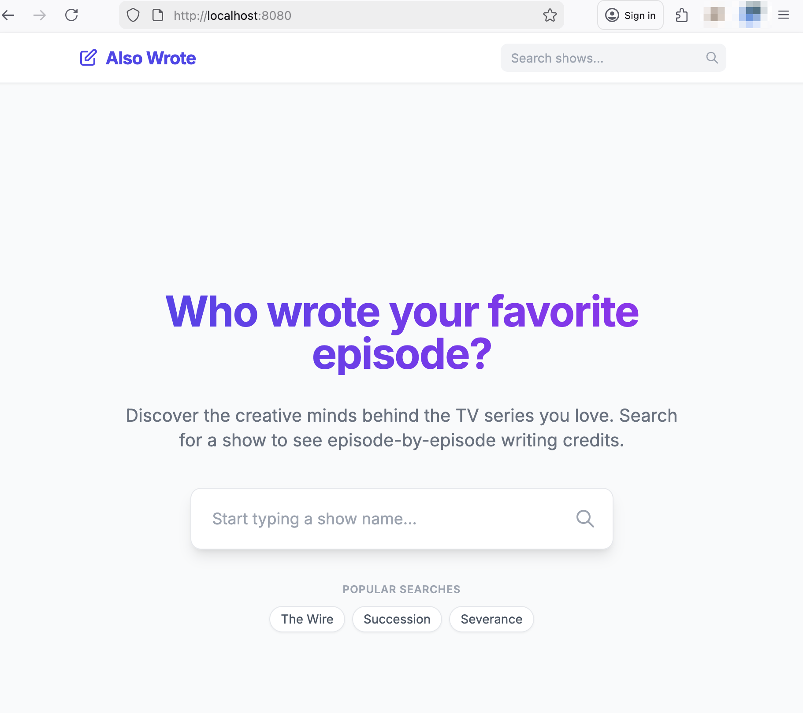
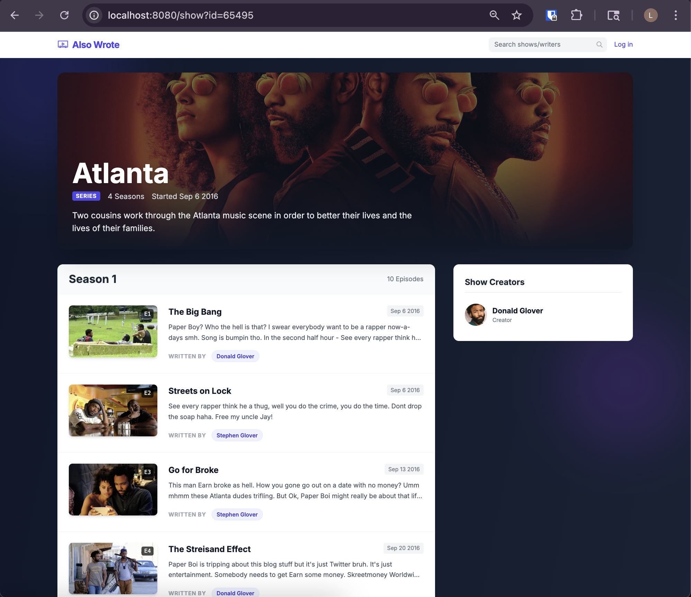
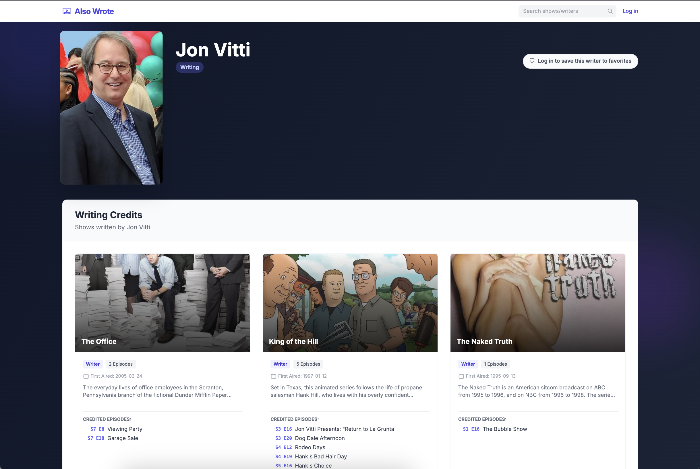
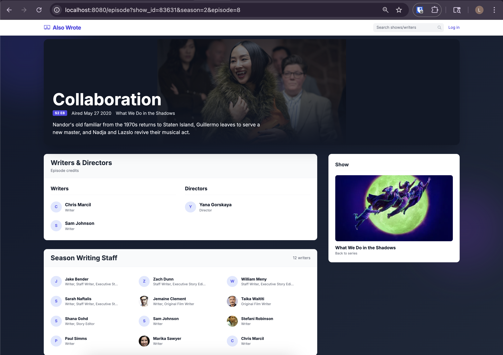
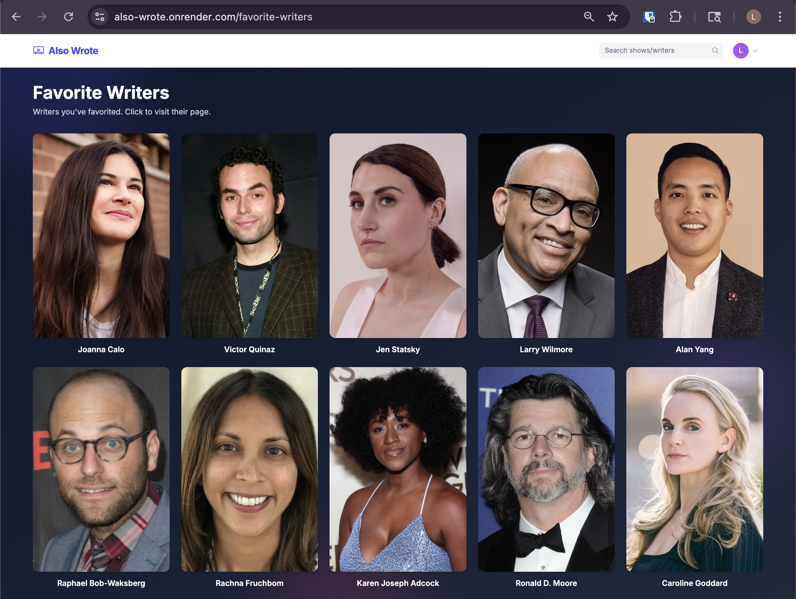
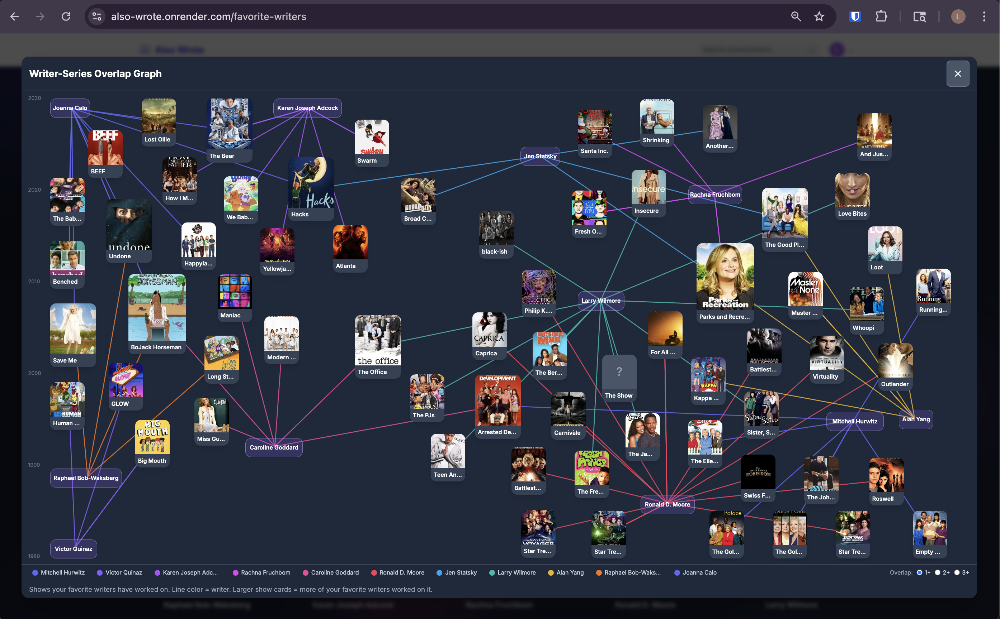
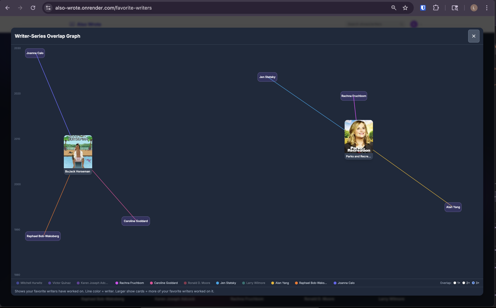

# Also Wrote

A simple Go application to discover the writers behind your favorite TV shows using the TMDB API.

## **Live Demo:**

<a href="https://also-wrote.onrender.com" target="_blank" rel="noopener noreferrer">https://also-wrote.onrender.com</a>
<br>

## Features

- **Search by Show**: Find TV series by title.
- **Search by Writer**: Find TV writers by name.
- **Episode Details**: Browse all episodes organized by season, with full writing staff lists.
- **Writer Credits**: Identify writers for each episode.
- **Writer Profiles**: Click on a writer to see their other works and specific credited episodes.
- **Sign in with Magic Link**: Enter your email to receive a one-time sign-in link (no password).
- **Favorite Writers**: Save your favorite writers.

## Screenshots

<div align="center">
  
  <br><em>Landing Page</em><br><br>

  
  <br><em>Show Details</em><br><br>

  
  <br><em>Writer Details</em><br><br>

  
  <br><em>Episode Details</em><br><br>

  ### Logged in features
  
  <br><em>Favorite Writers Page</em><br><br>

  
  <br><em>Writer/Series Overlap Graph</em><br><br>

  
  <br><em>Writer/Series Overlap Graph (filtered)</em><br><br>
</div>

## Setup

1.  **Clone the repository** (if you haven't already).
2.  **PostgreSQL**: Create a local database for development:
    ```bash
    createdb also_wrote
    ```
3.  **Create .env file**:
    Copy `.env.example` to `.env` and add your [TMDB API Token](https://www.themoviedb.org/settings/api) and your username to the `DATABASE_URL`.
    Optionally set SMTP vars if you want magic-link emails sent instead of printed in the server log.
    ```bash
    cp .env.example .env
    ```
4.  **Run the application**:
    ```bash
    go run main.go
    ```
5.  **Open your browser**:
    Visit [http://localhost:8080](http://localhost:8080). 
    Without SMTP configured, magic links are printed in the server log when you request a sign-in email.

## Project Structure

- `main.go`: Main application entry point and HTTP server.
- `internal/tmdb`: TMDB API client implementation.
- `templates/`: HTML templates for the UI.
- `static/`: Static assets (if any).

## Dependencies

- Go 1.16+
- Tailwind CSS (via CDN)

## Testing

**To run unit tests** (auth, ratelimit — no database or API keys required):

```bash
go test ./...
```

**Pre-commit hook** — Run all tests (unit + DB integration) before every commit:

```bash
cp scripts/pre-commit .git/hooks/pre-commit && chmod +x .git/hooks/pre-commit
```

You must have the test database (`createdb also_wrote_test`) for the hook to pass.

**To run DB integration tests** Use a separate test database so tests don’t touch dev data.

1.  **PostgreSQL**: Create a local database for tests:
    ```bash
    createdb also_wrote_test
    ```

2. Run tests with the `integration` build tag:
   ```bash
   go test -tags=integration ./...
   ```

DB tests use `TEST_DATABASE_URL` if set, otherwise `postgres://localhost/also_wrote_test?sslmode=disable`. They create and remove temporary users so the test database stays clean.
